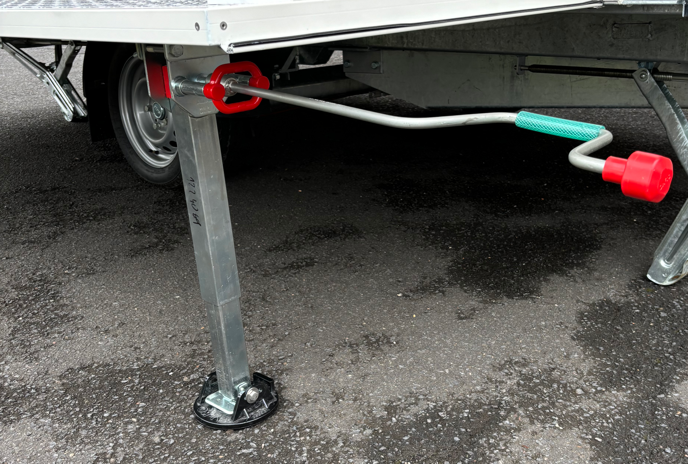
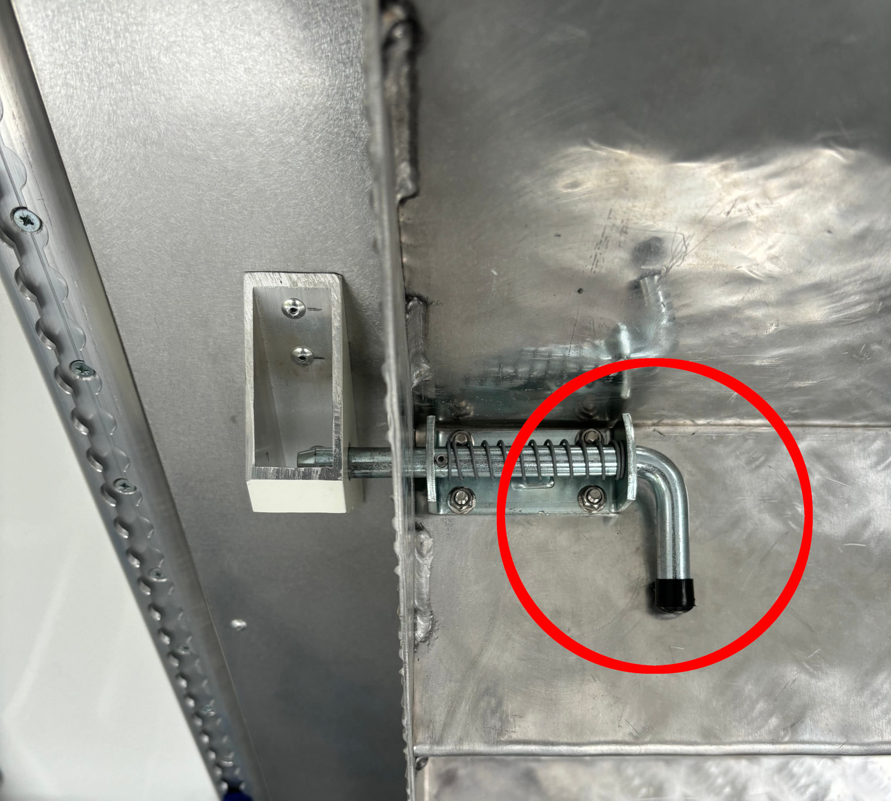
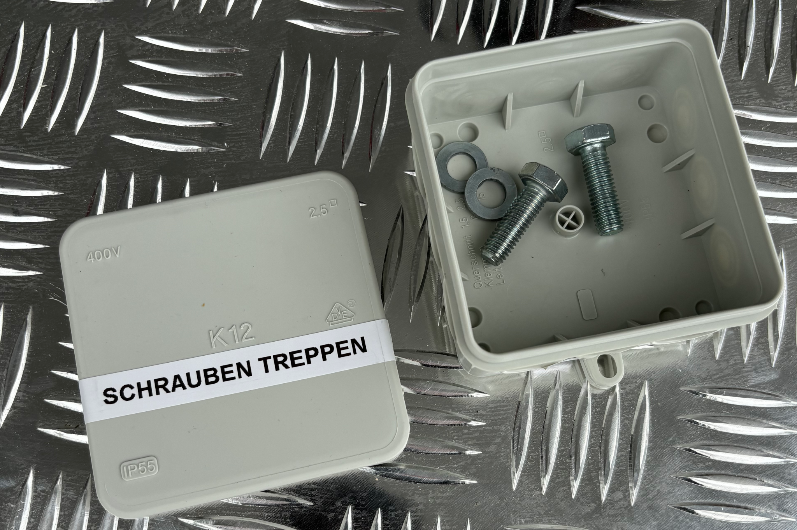
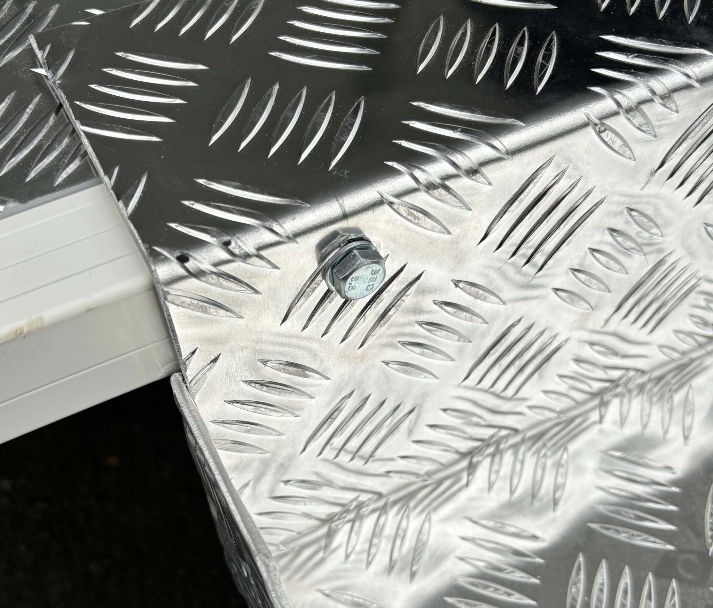
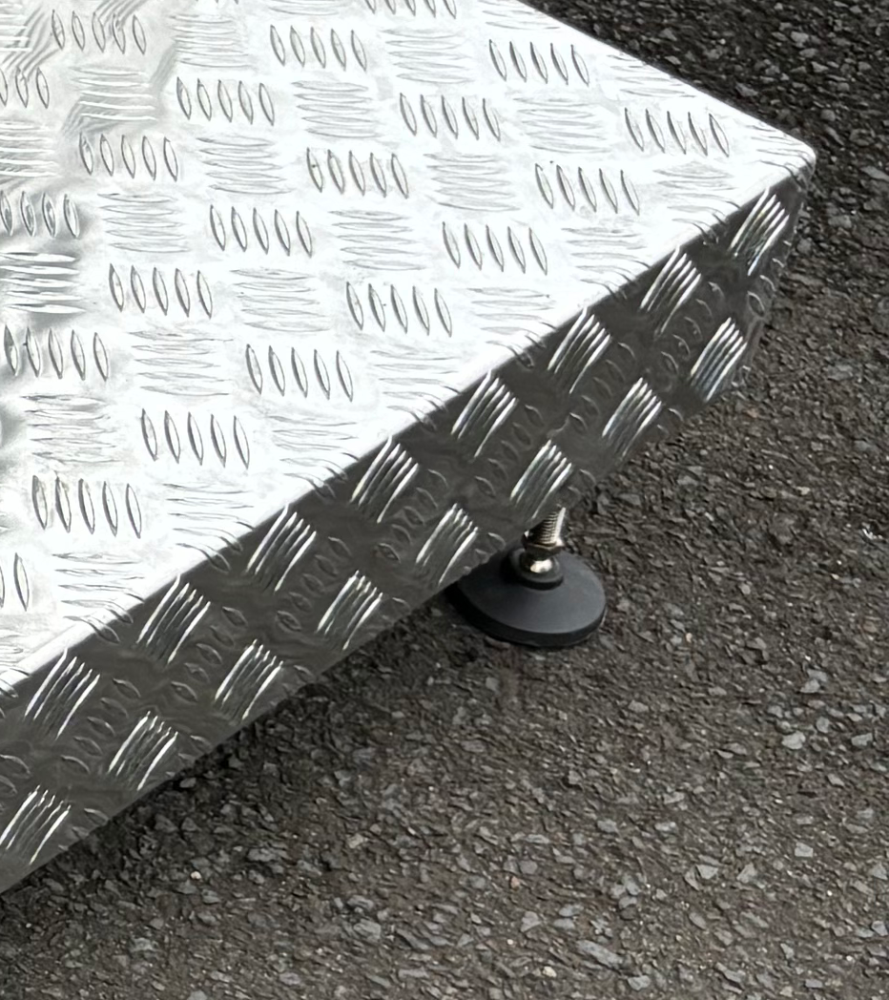

# Aufbau des Anhängers

Hier wird der Aufbau des Anhängers beschrieben. Danach sind ggf. weitere Schritte auszuführen wie z.B. der [Aufbau der Stromversorgung](stromversorgung.md) sowie die [Inbetriebnahme der Tontechnik](tontechnik.md)

## Wahl des Aufstellortes

Der Aufstellort sollte möglichst grade sein. Geringe Steigungen in Fahrtrichtung des Anhängers lassen sich ausgleichen, in andere Richtungen jedoch nicht.

## Aufstellen und Abstützen des Anhängers

Nachdem der Anhänger in Position gebracht wurde, ist er in der Regel vom Zugfahrzeug zu trennen. Dies hat den Hintergrund, dass aufgrund der Starrdeichsel und der Höhe der Anhängerkupplung des Zugfahrzeuges ansonsten der Anhänger i.d.R. nicht gerade steht. Der Anhänger kann durch Anziehen der Handbremse gegen Wegrollen gesichert werden, bei längerem Abstellen sollte diese jedoch gelöst sein (die Bremse ist als Trommelbremse ausgeführt und kann sich bei längere Standzeit festsetzen). Des Weiteren befinden sich in der Tür des Aufbaus zwei Unterlegkeile zum Sichern des Anhängers.

Mit dem Stützrad kann der Anhänger in eine gerade Position gebracht werden.

Als nächstes sind die Stützen des Anhängers auszufahren. Auf weichen Untergründen (z.B. Wiesen) sollten diese unterbaut werden, dazu befinden sich in der Kiste "Zubehör Anhänger" Unterlegplatten. Zum Auskurbeln der Stützen kann die Kurbel, welche in der Tür eingehängt ist, verwendet werden.

<figure markdown="span">
{: style="width:300px"}<figcaption>Unterbaute Stütze</figcaption></figure>

!!! warning "Achtung"

    Mit den Stützen ist der Anhänger lediglich abzustützen, er darf nicht aus der Achse herausgehoben werden, dies kann sehr schnell zu Beschädigungen an den Stützen führen.

## Abstützen der Bodenklappe und Öffnen der Klappen

In der Kiste "Zubehör Anhänger" befinden sich drei Stützen für die Bodenklappe. Diese sind wie auf dem Bild gekennzeichnet außen an der Bodenklappe anzubringen. 

<figure markdown="span">
{: style="width:300px"}<figcaption>Montierte Brackenstütze</figcaption></figure>

<figure markdown="span">
{: style="width:300px"}<figcaption>Gesamtansicht der Brackenstützen</figcaption></figure>

Anschließend können die Klappen geöffnet werden. Die Schlösser können zum einen von außen mit dem Schlüssel oder von innen an Handgriffen geöffnet werden.

Die Stützen der Bodenklappe können mit derselben Kurbel eingestellt werden, mit dem auch die Stützen des Anhängers eingestellt wurden. Ggf. sind auch diese Stützen zu unterbauen.

<figure markdown="span">
{: style="width:300px"}<figcaption>Einstellen der Brackenstütze mit der Kurbel</figcaption></figure>

## Einhängen der Treppenstufen

Die Treppenstufen können aus dem Aufbau entnommen werden, in dem der im Bild gekennzeichnete Griff gezogen wird. 

<figure markdown="span">
{: style="width:300px"}<figcaption>Griff zur Entnahme der Treppenstufen</figcaption></figure>

Die Treppenstufen sind vorne an der Bodenklappe einzuhängen und mit der Bodenklappe zu verschrauben. Die Schrauben und passende Maulschlüssel befinden sich in der Kiste "Zubehör Anhänger".

<figure markdown="span">
{: style="width:300px"}<figcaption>Dose mit den Schrauben für die Treppenstufen</figcaption></figure>

<figure markdown="span">
{: style="width:300px"}<figcaption>Verschrauben der Stufen</figcaption></figure>

Der für das Einstellen der Füße notwendige Maulschlüssel befindet sich ebenfalls in der Kiste, ggf. ist auch hier zu unterbauen.

<figure markdown="span">
{: style="width:300px"}<figcaption>Einzustellender Treppenfuß</figcaption></figure>

<figure markdown="span">
{: style="width:300px"}<figcaption>Vollständig verschraubte Treppe</figcaption></figure>
