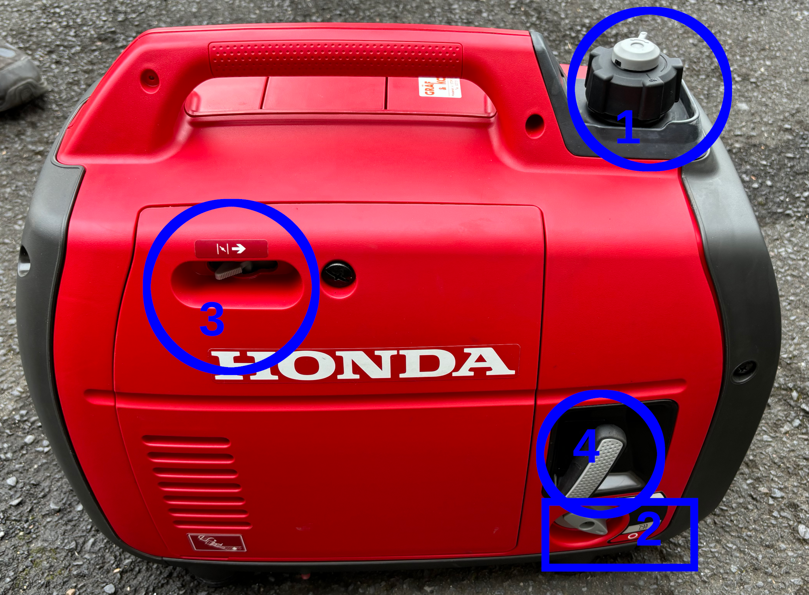

# Stromerzeuger

Um einen autarken Betrieb des Anhängers ermöglichen, ist der Anhänger mit einem Stromerzeuger vom Typ "Honda eu22i" ausgerüstet.

## Aufstellen und Vorbereiten des Stromerzeugers

Der Stromerzeuger ist so aufzustellen, dass sich im Bereich des Aufpuffs keine brennbaren Stoffe befinden. In der Kiste "Zubehör Anhänger" befindet sich ein Erdungsspieß mit Erdungskabel, so dass der Generator ggf. geerdet werden kann.

Vor Inbetriebnahme ist der Generator zu betanken (Tankvolumen 3,6l).

!!! warning "Wichtiger Hinweis"

    Der Stromerzeuger wird mit dem länger lagerfähigen Sonderkraftstoff "Aspen 4T" betankt. Sollte bei einem Einsatz der Sonderkraftstoff zur Neige gehen und kurzfristig kein Ersatz verfügbar sein, so kann auch normales Tankstellenbenzin "Super E5" getankt werden. Der Kraftstofftank sollte vor einem Sortenwechsel möglichst leergefahren werden.

## Starten des Generators

Das Starten des Generators erfolgt durch die folgenden Schritte:

1. Tankbelüftung auf der Oberseite öffnen

2. Choke auf Startstellung stellen (entfällt bei betriebswarmem Motor)

3. Betriebsschalter einschalten

4. Am Starterseil ziehen, bis der Generator anspringt

5. Nach dem Anspringen Choke in Betriesstellung stellen

6. Kabeltrommel zum Anhänger anschließen

<figure markdown="span">
{: style="width:300px"}<figcaption>Seitenansicht des Stromerzeugers mit Tankbelüftung (1), Betriebsschalter (2), Choke (3) und Anlasserseil (4)</figcaption></figure>

<figure markdown="span">
{: style="width:300px"}<figcaption>Frontansicht des Stromerzeugers mit Steckdosen (1) und Erdungskontakt (2)</figcaption></figure>

## Nachtanken

Zum Nachtanken Generator abstellen, dabei darauf achten, dass kein Kraftstoff verschüttet wird und auf heiße Motorenteile kommt.

## Abstellen des Generators

Vor dem Abstellen des Gernators Verbraucher abtrennen und noch ca. 2 Minuten lastfrei weiterlaufen lassen, um einen Hitzestau zu vermeiden.
